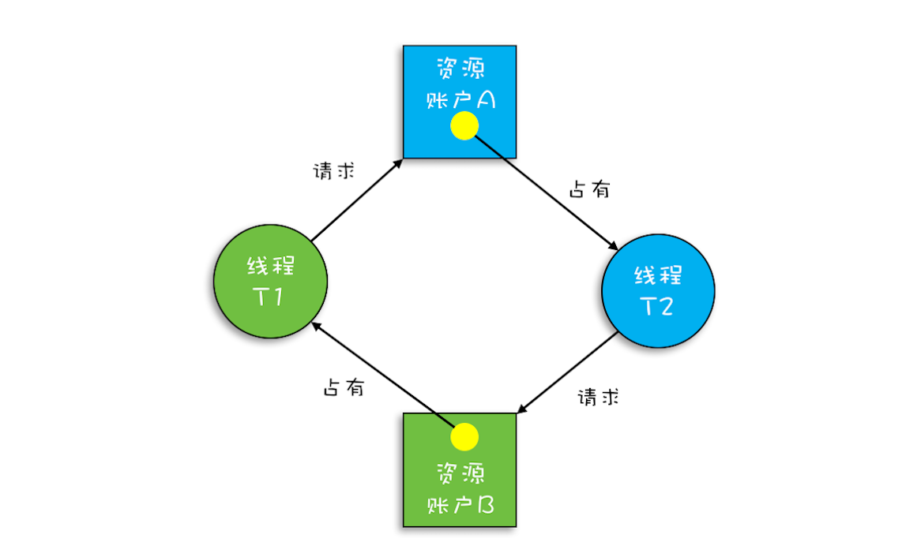

# 一不小心就死锁了，怎么办？

## 优化上一章的性能

上一章在转账的操作中我们为了防止产生并发问题，使用了Account的类对象对转账操作进行加锁
这样会导致所有的转账操作串行执行，极大的影响效率
为了提升转账操作的效率，我们可以使用细粒度锁来实现
例如Account.Java中的代码

## 死锁问题

使用细粒度锁能够提升转账方法的性能，但是却引进了死锁的问题
假如A和B同时向对方转账

1. A获得了A的锁，请求B的锁
2. B获得了B的锁，请求A的锁

这样就会因为各自持有了对方需要的锁，又请求了对方持有的锁导致了一直在阻塞

## 预防死锁问题

死锁发生后只能重启应用，否则会一直阻塞。所以我们要尽量避免死锁
发生死锁的四个必要条件：

1. 互斥：资源必须是互斥的，同一时间只能有一个线程在执行
2. 占有且等待：线程至少持有一个资源，且正在等待其他线程所持有的资源
3. 不可剥夺：线程持有的资源只能自己释放，不能被强制剥夺
4. 循环等待：线程T1等待线程T2占有的资源，线程T2等待线程T1占有的资源

所以我们预防死锁只需要破坏除互斥外的某个条件即可，因为互斥是我们使用锁的目的

### 破坏占有且等待条件

transformPreventDeadlockMethod1
占有且等待条件是至少持有一个资源，且还在等待别的线程持有的资源
那么我们可以使线程要么获取到所有的资源要么一个资源也获取不到
创建一个Allocator类，预处理要加的锁对象，如果任意一个已被持有则循环等待
只有同时都是未持有状态，才会去加锁

### 破坏不可剥夺条件

破坏不可剥夺条件的含义就是在申请不到资源是能够主动释放已申请的资源，java.util.concurrent这个包下面提供的Lock可以解决这个问题，后面会讲

### 破坏循环等待条件

transformPreventDeadlockMethod2
产生循环等待的原因是多个线程申请的锁顺序不一致导致的
那么我们可以选取锁对象的一个唯一性的字段为加锁顺序作排序依据，每个线程都按照这个顺序加锁就永远不会发生循环等待的条件

