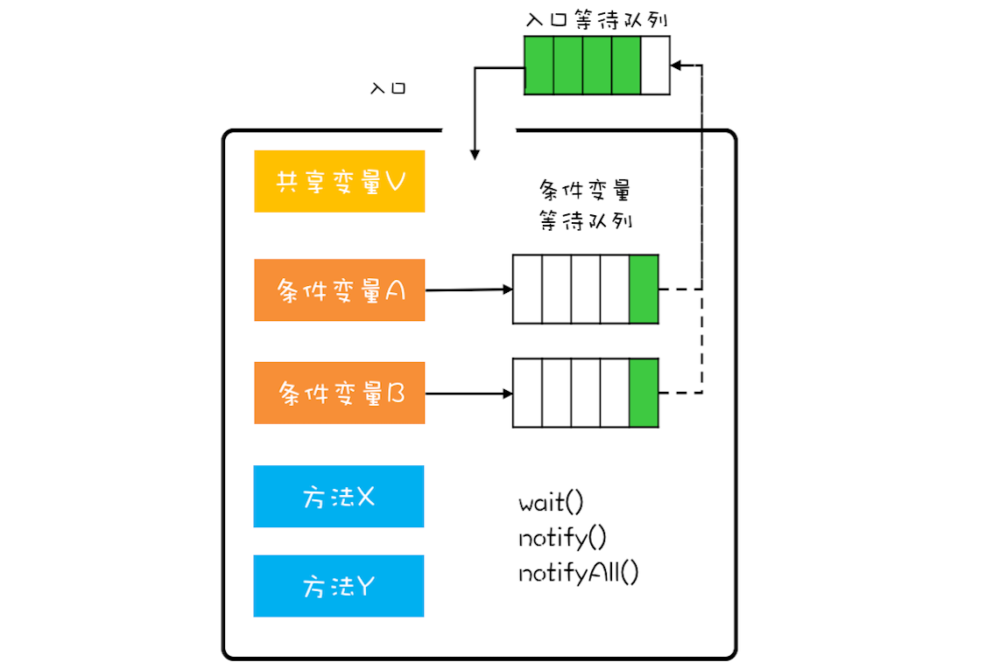

# 管程：并发编程的万能钥匙

管程指的是管理共享变量以及对共享变量的操作过程，让他们保证并发安全

## MESA模型

并发要解决同步和互斥的问题
MESA使用锁以及阻塞队列来解决互斥问题，使用条件变量和等待队列来解决同步问题

本包下有示例代码

## wait操作范式

```java
while(条件不满足){

wait();
}
```

因为MESA管程和别的管程模型不一样，他调用notifyAll()之后对应的线程会进入锁的等待队列
这样等该线程再次获取到互斥锁时条件就不一定满足了，又因为被唤醒的线程获取锁后会从wait()方法开始往下执行
所以使用while修饰可以保证获取到互斥锁之后重新校验条件是否满足，使用if就不会再次校验了

## 使用notify()的条件

1. 所有等待线程拥有相同的等待条件
2. 所有等待线程被唤醒后执行相同的操作
3. 只需要唤醒一个线程
